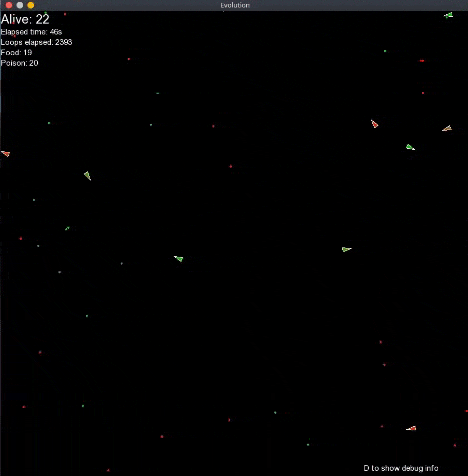

# Progetto di fine corso di Advanced Programming Using C++
## Introduzione
Il presente codice rappresenta il progetto finale del corso di Advanced Programming using C++ (Laurea magistrale in Fisica con curriculum Particle Astroparticle Physics and Advanced Technologies UniBa). Si tratta di un algoritmo di evoluzione continua. L'ambiente è composto da veleno e cibo e i veicoli (inizialmente generati con DNA casuale) "imparano" a mangiare il cibo evitando il veleno. I veicoli perdono progressivamente vita (diventando rossi) e scompaiono. Se mangiano cibo recuperano una porzione di vita, se mangiano veleno la perdono. Ad ogni loop hanno una piccola probabilità di clonarsi generando una copia con DNA modificato dell'10%. L'algoritmo si basa quindi sull'evidenza che i veicoli con DNA più efficiente hanno più probabilità di essere clonati (in quanto sopravvivono più a lungo). I parametri caratterizzanti il DNA dei veicoli sono quattro e rappresentano affinità (cioè quanto "forte" il veicolo è attratto) e sensibilità (cioè quanto lontano riesce a percepire) a cibo e veleno; ci aspettiamo quindi che a sistema ottimizzato si avrà grande affinità e sensibilità al cibo e bassissima sensibilità al veleno. L'affinità al veleno invece anche
dopo l'ottimizzazione non sembra avere una grande influenza.
Si parla inoltre di "evoluzione continua" in quanto non si hanno generazioni precise che si susseguono, ma ogni individuo presenta probabilità autonoma di riprodursi.

Per la renderizzazione a schermo si è utilizzata la libreria SFML.

## Utilizzo del programma
### Metodo 1: Compilare ed eseguire sulla macchina fisica
Per compilare ed eseguire il codice sulla macchina locale, è necessaria una suite di compilazione (l'ambiente di test attuale utilizza g++) ed eventualmente cmake e make e la libreria [ SFML ](https://www.sfml-dev.org/). Per installarla seguire le istruzioni
all'indirizzo [Installare SFML](https://www.sfml-dev.org/tutorials/2.5/start-linux.php).

Il workflow da eseguire per modificare l'app e ricompilarla è il seguente:
- Modificare uno o più file sorgente.
- Se è la prima volta eseguire `$ cmake -B build/` nella cartella root del progetto per creare i file di build (oppure compilare tutto con lo script [compile.sh](compile.sh)).
- Ricompilare solo i file modificati usando `$ make` all'interno della cartella build.
- Eseguire il binario generato.

### Metodo 2: Compilare ed eseguire nel docker
TODO

## Commento del codice


I cerchi rossi e verdi rappresentano la sensibilità rispettivametne a veleno e cibo, mentre le linee sono l'affinità (se negativa punteranno verso dietro).

Commentiamo adesso brevemente le varie parti del codice. Per prima cosa si noti che il codice è stato diviso seguendo il paradigma di modularità di C++. Nella cartella src/ sono presenti i file sorgente con le definizioni di funzioni e classi
mentre nella cartella include/ sono presenti gli header con le dichiarazioni.
### Librerie e utilities
#### 1. randomTools
Libreria più semplice, contiene solo una serie di funzioni (racchiuse in un namespace) per generare numeri casuali. Inizialmente erano state implementate due diverse funzioni per la generazione di interi o float:

```cpp
float randomTools::randomFloat(float start, float stop) {
    // Generatore random di float tra start e stop
    // :param: start -> Valore di inizio (default 0)
    // :param: stop -> Valore di fine (default 1)
    // :return: float random tra start e stop
    std::random_device rd;
    std::default_random_engine eng(rd());
    std::uniform_real_distribution<float> distr(start, stop);
    return distr(eng);
}

int randomTools::randomInt(int start, int stop) {
    // Generatore random di interi tra start e stop.
    std::random_device rd;
    std::default_random_engine eng(rd());
    std::uniform_int_distribution<int> distr(start, stop);
    return distr(eng);
}
```

Si noti che la necessità dell'utilizzo di `std::uniform_int_distribution<>()` e `std::uniform_real_distribution<>()` rende complicato l'utilizzo di un template. Comunque, in un successivo refactoring, è stato aggiunto il template:

```cpp
template <typename T>
T randomTools::randomGenerator(const T& start, const T& stop) {
  std::random_device rd;
  std::default_random_engine eng(rd());
  std::uniform_real_distribution<> distr(start, stop);
  return static_cast<T>( distr(eng) );
}
```
questa soluzione riduce drasticamente la quantità di codice scritta ma non è molto efficiente, in quanto genera sempre con la distribuzione reale per float e solo successivamente fa un casting nel tipo rilevato alla chiamata.

Comunque, essendo questa funzione stata scritta successivamente, per evitare una riscrittura parziale anche degli altri source, si è scelto di adattare le funzioni `randomFload()` e `randomInt()` perchè utilizzino `randomGenerator`.

#### 2. vectorTools
Una serie di funzioni utili per la manipolazione di vettori di float (classe `sf::Vector2f` messa a disposizione da SFML) come il calcolo del modulo, la moltiplicazione per uno scalare eccetera.

#### 3. utilities


Funzioni inizialmente nel main, successivamente spostate in un modulo a parte. Interessante la funzione `creaCibo()`, che prende in ingresso la finestra su cui renderizzare, la bontà del cibo da creare e
la posizione in cui creare il cibo e restituisce un puntatore unico ad una `sf::CircleShape`, classe builtin di SFML che rappresenta un cerchio. Se la posizione non viene passata, il cibo (o veleno) viene creato
in un punto random dello schermo.

```cpp
std::unique_ptr<sf::CircleShape> utilities::creaCibo(sf::RenderWindow &finestra, bool buono, sf::Vector2f posizione) {
  // Restituisce un puntatore unico a un cibo in una posizione random dello
  // schermo :param: buono, se vero crea un cibo, altrimenti crea un veleno
  // :param: posizione, se viene passato lo usa per creare nella posizione,
  // altrimenti crea random
  std::unique_ptr<sf::CircleShape> cibo{new sf::CircleShape{2}};

  if (posizione.x >= 0 && posizione.y >= 0) {
    cibo->setPosition(posizione.x, posizione.y);
  } else {
    cibo->setPosition(randomTools::randomFloat(0, finestra.getSize().x), randomTools::randomFloat(0, finestra.getSize().y));
  }

  if (buono) {
    cibo->setFillColor(sf::Color::Green);
  } else {
    cibo->setFillColor(sf::Color::Red);
  }

  return cibo;
}
```
il motivo della scelta di restituire un puntatore intelligente e non una normale CircleShape sarà discusso nella parte del main. Si noti, comunque, che, pur essendo un puntatore unico, è possibile restituirlo
dalla funzione prima che vada out of scope. Questa operazione è tipica dei puntatori unici in quanto dopo l'esecuzione della funzione il point count del puntatore sarà comunque 1 (solo il puntatore a cui viene
assegnato il valore di ritorno della funzione punterà all'area di memoria contenente la CircleShape, mentre il puntatore presente nella funzione andrà out of scope e sarà distrutto).

La funzione `creaTesto()`, invece, è solo una utility per ottenere un testo in un punto dello schermo. Anche qui si utilizza una classe builtin di SFML per modellizzare il testo.

### Classe veicolo

Questa è la classe fondamentale del progetto, modellizza il veicolo e il suo comportamento. Commentiamo i metodi principali.

Per prima cosa vediamo il costruttore:

```cpp
Veichle::Veichle(float x, float y, std::vector<float> newDna) {
  // :param: x,y -> Posizione iniziale
  // :param: newDna -> Dna con cui creare il veicolo, opzionale.

  // Se il parametro dna non viene passato, lo inizializzo con valori random
  if (newDna.size() > 0) {
    dna = newDna;
  } else {
    // Inizializzo il dna con pesi a caso
    dna[0] = randomFloat(-5, 5);
    dna[1] = randomFloat(-5, 5);
    dna[2] = randomFloat(1, 100);
    dna[3] = randomFloat(1, 100);
  }

  // La figura deve essere un triangolo quindi setto 3 punti
  triangolo.setPointCount(3);
  // Setto l'origine al centro del triangolo
  triangolo.setOrigin(raggio, raggio / 2);
  // Setto la posizione ai parametri dati
  triangolo.setPosition(x, y);
  triangolo.setOutlineThickness(1);
  // Setto i vertici (in senso orario)
  triangolo.setPoint(0, sf::Vector2f(raggio, 0));
  triangolo.setPoint(1, sf::Vector2f(-raggio, raggio / 2));
  triangolo.setPoint(2, sf::Vector2f(-raggio, -raggio / 2));
}
```
Se il dna non viene passato viene inizializzato con valori random e successivamente si settano i parametri della figura. Importante notare che non ci sono
inizializzazioni degli attributi nel costruttore, si è infatti scelto di inizializzare tutti gli attributi nella dichiarazione della classe. Questa scelta
snellisce il costruttore e dunque sembra la più appropriata. Chiaramente a livello esecutivo non c'è nessuna differenza in quanto le inizializzazioni fatte inline
nella dichiarazione vengono comunque eseguite prima del costruttore all'istanziazione di un nuovo oggetto della classe.

Il metodo `show()` semplicemente prende in ingresso la finestra su cui renderizzare e disegna la figura in base ai parametri specificati. In base al valore della
variabile di debug mostra o no le informazioni su affinità e percezione. La variabile di debug è una variabile statica della classe e viene modificata
direttametne dal main.

```cpp
void Veichle::update() {
  // Aggiornamento da fare ad ogni ciclo

  // Riduco la vita a ogni ciclo
  health -= 0.01;
  // I veicoli scompaiono al calare della vita
  triangolo.setFillColor(sf::Color((1 - health) * 255, health * 255, 0));
  // triangolo.setOutlineColor(sf::Color(255, 255, 255, 255 * health));
  // Setto l'origine delle rotazioni
  triangolo.setOrigin(0, 0);
  // Ruoto nella direzionde di movimento
  float angle = heading(vel);
  triangolo.setRotation(radToDeg(angle));
  // Applico l'accelerazione
  vel += acc;
  // Limito la velocità
  limitVector(vel, velocitalimite);
  // Muovo l'oggetto
  triangolo.move(vel);
  // Resetto l'accelerazione a 0
  multVector(acc, 0);
}
```

Il metodo `update()` deve essere chiamato ad ogni ciclo di esecuzione della simulazione e aggiorna lo stato del veicolo. La vita viene abbassata progressivamente
e il colore varia linearmente dal verde al rosso al diminuire della vita. Sucessivamente la punta del veicolo viene ruotata nella direzione di movimento e si
applica accelerazione e velocità per muovere il veicolo (si noti che `triangolo.move()` viene esposta da SFML e ha come effetto quello di sommare alla posizione
della figura, il vettore velocità passato come argomento. Si noti che la velocità massima viene limitata per permettere un movimento più fluido e reazioni più
verosimili.

L'algoritmo di ricerca del cibo (o veleno) è scritto nel metodo `seek()`. Restituisce una forza di attrazione tra il veicolo e l'oggetto. È necessario passare
come parametro la posizione dell'oggetto. La velocità ideale è quella che punta verso l'oggetto. La forza generata è il vettore differenza tra la velocità attuale
e la velocità ideale. In sostanza questo andrà a generare una rotazione fluida del veicolo verso l'oggetto da cercare. Anche in questo caso si deve limitare il
modulo del vettore forza per evitare reazioni troppo veloci e fuori controllo.

Vediamo il metodo `cercaVicino()`.
```cpp
sf::Vector2f Veichle::cercaVicino(std::vector<std::unique_ptr<sf::CircleShape>> &lista, float valoreNutrizionale, float percezione) {
  // Cerca l'oggetto più vicino nella lista passata e lo mangia.
  // :param: lista -> cibi o veleno
  // :param: valoreNutrizionale -> indica l'aumento o diminuzione della vita
  // :param: percezione -> indica la distanza massima a cui il veicolo percepisce l'elemento della lista
  // :return: vettore che indica la forza di attrazione verso l'elemento più vicino nella lista
  // :return: vettore nullo se ha mangiato
  // :return: vettore nullo se la lista è vuota

  // Controllo che la lista non sia vuota
  if (lista.size() > 0) {
    // Cerco il più vicino nella visuale del veicolo
    float distanzaMinima = 1e4;
    auto closest = lista.begin();

    // Itero sulla lista
    for (auto it = lista.begin(); it != lista.end(); ++it) {
      float distanza = dist(triangolo.getPosition(), (*it)->getPosition());

      if (distanza > percezione) {
        continue;
      } else {
        if (distanza < velocitalimite) {
            // Se mi trovo sull'oggetto, lo mangio e basta
            lista.erase(it--);
            health += valoreNutrizionale;
        } else if (distanza < distanzaMinima) {
            // Altrimenti aggiorno la distanza minima
            closest = it;
            distanzaMinima = distanza;
        }
     }


    if (distanzaMinima != 1e4) {
      sf::Vector2f posizioneVicino = (*closest)->getPosition();
      // Restituisco la forza di attrazione
      return seek(posizioneVicino);
    }
  }

  // Se la lista in input è vuota, oppure il più vicino è fuori dalla visuale
  // restituisco il vettore nullo
  return sf::Vector2f(0, 0);
}

```

Questo metodo permette al veicolo di cercare l'elemento più vicino. Si devono passare la lista (cibo o veleno), il corrispettivo valore nutrizionale (negativo
se veleno) e il range di percezione. Cerco l'elemento a distanza minima che si trovi nel range di percezione. Se ho aggiornato la distanza minima almeno una
volta, allora cerco l'elemento più vicino. Se lista è vuota oppure il più vicino è fuori dalla visuale, restituisco il vettore nullo. Il metodo quindi restituisce sempre un vettore rappresentante una forza. Si noti che qui è possibile notare la necessità di usare memoria dinamina e puntatori: è necessario rimuovere dalla
lista dei cibi l'elemento mangiato quando viene mangiato e quindi in maniera dinamica. Per fare questo si è utilizzato un iteratore ed il metodo erase.
Lo stesso succederà nel main con i veicoli che muoiono.

Il metodo `vivi()` mette insieme le ricerche ai vari elementi ed è il metodo chiamato dal main quindi pubblico. `edge()` gestisce gli spigoli ed evita che i
veicoli vadano troppo fuori schermo, per organicità e fluidità, il ritorno dall'esterno dello schermo è fatto con lo stesso algoritmo di ricerca.

Il metodo `clona()` restituisce un puntatore intelligente ad un nuovo veicolo, con DNA variato del 10% rispetto a quello che lo ha generato.

### Main
In questa parte del programma vengono gestite le finestre e il main loop di renderizzazione di SFML.

#### Preparazione al main loop
Per prima cosa vengono creati gli array di veicoli, cibi e veleni:

```cpp
std::vector<std::unique_ptr<Veichle>> veicoli;
  for (int i = 0; i < veicoliIniziali; ++i) {
    veicoli.push_back(std::unique_ptr<Veichle>{new Veichle(300, 300)});
  }

  std::vector<std::unique_ptr<sf::CircleShape>> cibi;
  for (int i = 0; i < ciboIniziale; ++i) {
    cibi.push_back(creaCibo(finestra, true));
  }
  std::vector<std::unique_ptr<sf::CircleShape>> veleno;
  for (int i = 0; i < velenoIniziale; ++i) {
    veleno.push_back(creaCibo(finestra, false));
  }
```
Si noti che, come accennato prima, è necessario utilizzare i puntatori intelligenti per poter successivamente eliminare dinamicamente alcuni degli oggetti
in base ad eventi runtime dell'applicazione.

Il passo successivo è iniziare a misurare il tempo, per poter stampare a schermo info sull'ambiente. Per fare questo si è usato il supporto del modulo
*chrono* della Standard Library.

#### Main loop
Terminate le operazioni preparatorie, è possibile iniziare il main loop `while (finestra.isOpen())` e per prima cosa viene aggiornato il tempo
misurato ad ogni loop. (Anche il numero di loop viene contato).

Importante notare lo statement `finestra.setFramerateLimit(60)` che blocca il framerate della GUI a 60 FPS. Senza di esso, infatti, l'hardware risultava
molto stressato fino anche a produrre rumori non intenzionali.

Guardiamo ora alla parte di gestione degli eventi della finestra.

```cpp
sf::Event ev;
while (finestra.pollEvent(ev)) {
  switch (ev.type) {
  case sf::Event::Closed:
    finestra.close();
    break;

  case sf::Event::KeyPressed:
    // Se premo d sulla tastiera attivo o disattivo la debug mode dei veicoli
    if (ev.key.code == sf::Keyboard::D) {
      Veichle::debug = !Veichle::debug;
    }
    break;
  }
}
```

Si tratta di un ciclo while in cui viene switchato il tipo di evento. Si gestisce la possibilità di chiudere la finestra e sul toggle delle info di
debug alla pressione del tasto D sulla tastiera.

A questo punto dei loop, prima di effettuare le operazioni di disegno, vengono invocati i metodi della classe veicolo.

```cpp
for (auto i = veicoli.begin(); i != veicoli.end(); ++i) {
  // l'oggetto *i rappresenta veicoli[i]
  (*i)->edges(finestra);
  (*i)->vivi(cibi, veleno);
  (*i)->update();
  (*i)->show(finestra);

  // Probabilià di clonare
  if (randomTools::randomFloat() < probClonare) {
    i = veicoli.insert(i, (*i)->clona());
    i++;
  }

  if ((*i)->dead()) {
    // Se l'elemento i-simo è morto, lo elimino.
    // Inoltre creo un cibo nella posizione
    // i-- restituisce i a erase e poi decrementa. Così elimino l'elemento
    // ma non salto niente
    cibi.push_back(creaCibo(finestra, true, (*i)->getposition()));
    veicoli.erase(i--);
  }
}
```

A causa della necessità di eliminare dal vettore i veicoli morti, per effettuare le operazioni su ogni veicolo si devono usare gli itaeratori. Solo in
questo modo, infatti, è possibile eliminare il veicolo morto (tramite il metodo `std::vector<>.erase()`) e aggiungere il veicolo clonato tramite
`std::vector<>.insert()`. L'operazione è delicata in quanto le azioni di eliminazione di un inserzione e rimozione da una lista tendenzialmente
invalidano gli iteratori. In questo caso il problema è aggirato tramite lo statement `i = veicoli.insert(i, (*i)->clona());`. Il metodo `insert()`, infatti,
restituisce un nuovo iteratore che viene riassegnato ad i prima di essere incrementato.

Per quanto riguarda l'operazione di eliminazione, invece, il metodo `erase()` in sé non invalida l'iteratore, è però necessario fare attenzione a non
saltare l'elemento successivo nel loop una volta effettuata l'eliminazione. Per questo si utilizza il postincremento. In particolare, lo statement
`veicoli.erase(i--)` sarebbe equivalente a `veicoli.erase(i); --i`. Tutto il vettore scala dopo l'eliminazione e quindi si deve riportare i al valore
precedente per non saltare nessun veicolo. È chiaro che questa operazione non è computazionalmente ottimale, eliminare un elemento da un'array list,
infatti, è sempre dispendioso, soprattutto a causa della necessità di scalare gli altri elementi. Probabilmente sarebbe necessario utilizzare una
struttura dati differente, probabilmente sarebbe più efficiente una linked list, comunque, la scelta è dovuta alla semplicità di scrittura del codice.

L'ultima parte del main loop consiste semplicemente nel disegno di ogni oggetto all'interno della finestra tramite appositi cicli.


## Nota sulla compilazione
Il progetto è stato diviso in moduli che sono stati compilati separatamente e successivamente linkati al main tramite l'uso del linker. In prima approssimazione si è scritto un brevissimo script in bash [compile.sh](compile.sh)
```bash
#!/bin/bash

if [[ $# != 1 ]]; then
    echo "Uso: bash compile.sh <nomeOutput>"
    exit 1
else
    echo "Compilo il progetto e linko le librerie"
    cd src
    for source in ./*; do
        if [[ $source != "./main.cpp" ]]; then
            echo "Compilo il file "$source
            /usr/bin/g++ -c $source -o "../binari/"$source".o"
        fi
    done
    echo "File compilati, linko le librerie sfml"
    cd ..
    /usr/bin/g++ -o ./binari/$1 ./binari/randomTools.cpp.o ./binari/utilities.cpp.o ./binari/vectorTools.cpp.o ./binari/veichle.cpp.o ./src/main.cpp -lsfml-graphics -lsfml-window -lsfml-system
    exit 0
fi
```
Lo script compila i file sorgente separatamente ponendoli nella cartella *binari* e successivamente compila il main.cpp linkando gli object file e le librerie sfml.

Successivamente si è optato per una soluzione più automatica utilizzando il software CMake che produce automaticamente il Makefile. Il vantaggio di questo approccio è la semplicità nella gestione,
infatti, una volta prodotto il Makefile, il comando make procederà alla compilazione e al linking delle librerie. Interessante notare che utilizzando make, solamente i file sorgente modificati vengono ricompilati, diversamente dallo script sopra in cui ad ogni esecuzione viene ricompilato tutto il codice, rendendo il processo inutilmente lento e poco scalabile.

Commentiamo il file di generazione del Makefile.

```cmake
cmake_minimum_required(VERSION 3.16)
project(Evolution)

include_directories(include)
file(GLOB SORGENTI "src/*.cpp")

find_package(SFML 2.5.1 COMPONENTS system window graphics network audio REQUIRED)

add_executable(evolution.out ${SORGENTI})

target_link_libraries(evolution.out PUBLIC sfml-window sfml-graphics sfml-network sfml-system)

```

Per prima cosa si richiede una versione minima di cmake e si da un nome al progetto, successivamente si specifica la directory contenente gli header files e i file sorgente, a questo punto si richiede
la presenza della libreria SFML, poi si compila tutto e infine si linkano le librerie all'eseguibile generato.
